# SOC Analyst Detection Engineering Lab with Splunk

## Project Overview

This project demonstrates a focused SOC analyst detection engineering workflow using Splunk to monitor Linux authentication activity. The lab focuses on SSH-based authentication attacks, including failed login detection, brute force behavior, username spraying, successful login after multiple failures, alert creation, dashboarding, and validation testing.

The goal was to build a realistic detection workflow from start to finish:

- Generate attack telemetry
- Search and analyze Linux authentication logs
- Extract useful fields from raw events
- Build threshold-based detections
- Add time-window logic to reduce false positives
- Create and validate a Splunk alert
- Build a SOC-style monitoring dashboard
- Document the workflow professionally

---

## Lab Environment

| Component | Details |
|---|---|
| Host Machine | Windows 11 |
| Virtualization | Oracle VirtualBox |
| Target System | Ubuntu VM |
| Network Mode | Bridged Adapter |
| SIEM Platform | Splunk Enterprise |
| Log Source | `/var/log/auth.log` |
| Splunk Index | `security` |
| Sourcetype | `linux_auth` |
| Attack Method | SSH login attempts from Windows host to Ubuntu VM |

---

## Project Objectives

The main objectives of this lab were to:

- Detect failed SSH authentication attempts
- Identify source IP addresses responsible for failed logins
- Build brute force detection logic using thresholds
- Add time-based detection windows to improve accuracy
- Detect username spray behavior
- Correlate failed logins with successful authentication
- Create a Splunk alert for suspicious login behavior
- Validate that the alert triggers successfully
- Build a dashboard for SOC-style monitoring

---

## Log Ingestion Validation

Before building detections, I verified that Splunk was successfully ingesting Linux authentication logs from the Ubuntu VM.

```spl
index=security sourcetype=linux_auth
```

This confirmed that authentication-related activity from `/var/log/auth.log` was searchable inside the `security` index.

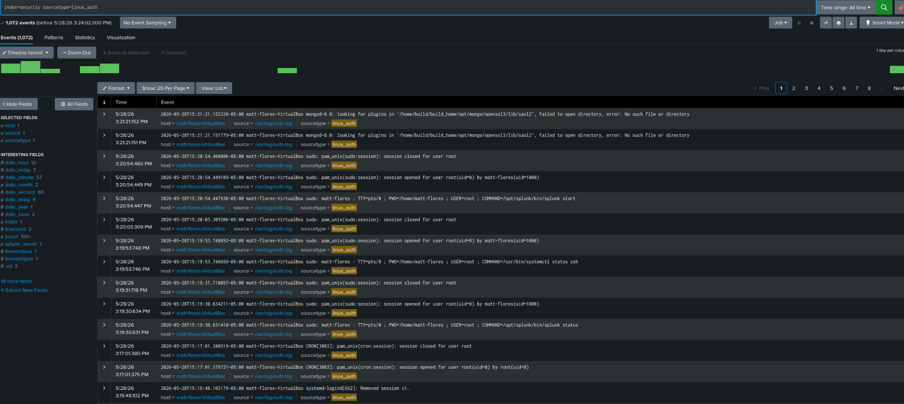

This validation step confirmed that Splunk was receiving the required telemetry before detection logic was created.

---

## Attack Simulation

Attack traffic was generated from the Windows host against the Ubuntu VM using SSH.

Example command:

```powershell
ssh fakeuser@192.168.1.247
```

Multiple failed login attempts were generated using invalid usernames and incorrect passwords.

Additional username spray testing was performed by attempting SSH logins against several different usernames:

```text
fakeuser
admin
oracle
test
```

This created realistic SSH authentication failure events inside the Linux authentication logs.

---

## Detection 1: Failed SSH Login Events

The first detection focused on identifying failed SSH authentication attempts.

```spl
index=security "Failed password"
```

This search returned raw failed SSH login events, including attempted usernames, source IP addresses, source ports, and SSH daemon activity.

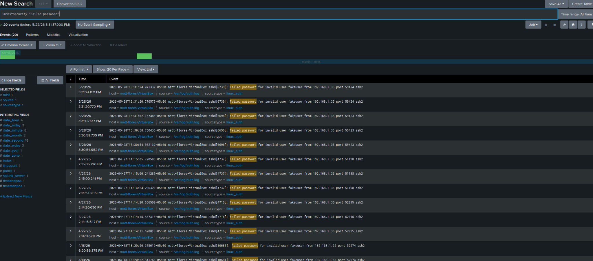

This confirmed that the simulated attack activity was being logged and indexed by Splunk.

---

## Detection 2: Basic Failed Login Count

After confirming raw failed login events, I summarized the events by host.

```spl
index=security "Failed password"
| stats count by host
```

### Query Breakdown

| SPL Component | Purpose |
|---|---|
| `index=security` | Searches the custom security index |
| `"Failed password"` | Filters for failed SSH authentication events |
| `stats count by host` | Counts failed login events by host |

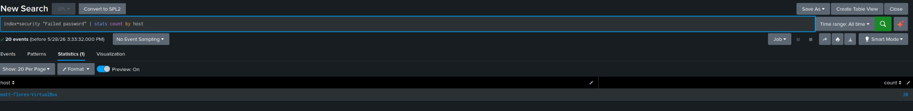

This moved the analysis from raw log review into basic detection aggregation.

---

## Detection 3: Source IP Extraction

The next step was identifying which source IP addresses were responsible for failed login attempts.

```spl
index=security "Failed password"
| rex "from (?<src_ip>\d+\.\d+\.\d+\.\d+)"
| stats count by src_ip
```

### Query Breakdown

| SPL Component | Purpose |
|---|---|
| `rex` | Extracts fields from raw event text using regex |
| `(?<src_ip>...)` | Creates a new field called `src_ip` |
| `\d+\.\d+\.\d+\.\d+` | Matches an IPv4 address |
| `stats count by src_ip` | Counts failed login attempts by source IP |

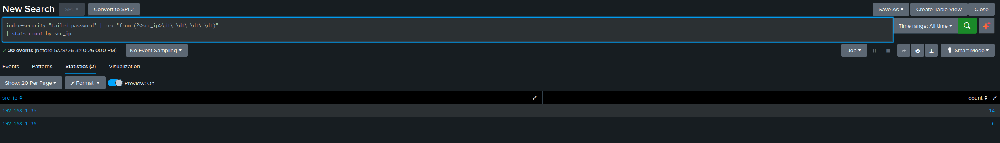

This detection identified attacker source IPs and allowed failed login activity to be grouped by origin.

---

## Detection 4: Brute Force Threshold Detection

A threshold was added to detect source IPs with repeated failed login attempts.

```spl
index=security "Failed password"
| rex "from (?<src_ip>\d+\.\d+\.\d+\.\d+)"
| stats count as failed_attempts by src_ip
| where failed_attempts >= 5
```

### Detection Logic

This detection flags a source IP when it generates 5 or more failed SSH login attempts.

| Field | Meaning |
|---|---|
| `src_ip` | Source IP responsible for failed logins |
| `failed_attempts` | Number of failed SSH login attempts |
| `where failed_attempts >= 5` | Threshold used to identify suspicious behavior |

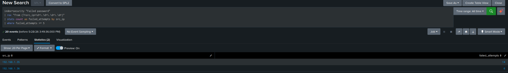

This created a basic brute force detection by identifying repeated authentication failures from the same source.

---

## Detection 5: Time-Based Brute Force Detection

The previous detection counted matching events across the selected time range. To make the detection more realistic, I added a 5-minute time window.

```spl
index=security "Failed password"
| rex "from (?<src_ip>\d+\.\d+\.\d+\.\d+)"
| bucket _time span=5m
| stats count as failed_attempts by _time, src_ip
| where failed_attempts >= 5
```

### Why Time Windows Matter

Counting failures across all time can create false positives. Five failed logins over several weeks is much less suspicious than five failed logins within a few minutes.

This query improves detection quality by identifying clustered failed login activity.

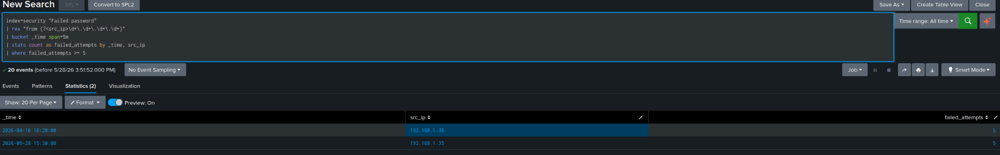

This made the brute force detection more realistic by incorporating both frequency and timing.

---

## Detection 6: Username Spray Detection

Username spraying occurs when an attacker attempts multiple usernames from the same source IP. This can indicate account enumeration or password guessing against common accounts.

```spl
index=security "Failed password"
| rex "invalid user (?<username>\w+)"
| rex "from (?<src_ip>\d+\.\d+\.\d+\.\d+)"
| stats dc(username) as unique_usernames values(username) as usernames by src_ip
| where unique_usernames >= 3
```

### Query Breakdown

| SPL Component | Purpose |
|---|---|
| `rex "invalid user (?<username>\w+)"` | Extracts attempted usernames |
| `dc(username)` | Counts distinct usernames |
| `values(username)` | Lists the usernames attempted |
| `where unique_usernames >= 3` | Flags source IPs attempting multiple usernames |

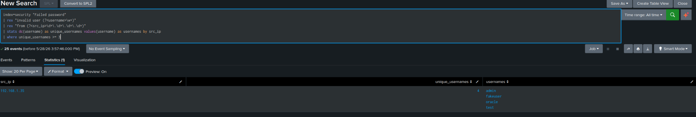

This detection shows suspicious activity where one source IP attempted authentication against multiple usernames.

---

## Successful SSH Login Event Validation

Successful SSH login events were confirmed using the following search:

```spl
index=security "Accepted password"
```

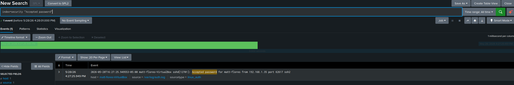

This confirmed that Splunk was ingesting successful authentication events as well as failed authentication events.

---

## Detection 7: Successful Login After Multiple Failures

One of the strongest detections in this lab correlates failed logins with a later successful login from the same source IP.

```spl
index=security ("Failed password" OR "Accepted password")
| rex "from (?<src_ip>\d+\.\d+\.\d+\.\d+)"
| eval login_status=if(searchmatch("Accepted password"),"SUCCESS","FAILURE")
| stats count(eval(login_status="FAILURE")) as failed_attempts count(eval(login_status="SUCCESS")) as successful_logins by src_ip
| where failed_attempts >= 3 AND successful_logins >= 1
```

### Detection Logic

This detection identifies source IPs that generated multiple failed login attempts and then successfully authenticated.

That pattern may indicate:

- Successful brute force activity
- Password guessing success
- Compromised credentials
- Suspicious authentication behavior requiring analyst review

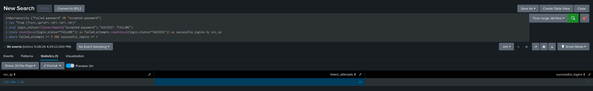

---

## Detection 8: Time-Window Successful Login After Failures

To make the successful-login-after-failures detection more accurate, I added a 10-minute time window.

```spl
index=security ("Failed password" OR "Accepted password")
| rex "from (?<src_ip>\d+\.\d+\.\d+\.\d+)"
| eval login_status=if(searchmatch("Accepted password"),"SUCCESS","FAILURE")
| bucket _time span=10m
| stats count(eval(login_status="FAILURE")) as failed_attempts count(eval(login_status="SUCCESS")) as successful_logins by _time, src_ip
| where failed_attempts >= 3 AND successful_logins >= 1
```

### Why This Detection Is Stronger

This search only identifies suspicious login sequences that occur within a defined 10-minute window. That makes the detection more useful than counting all failures and successes across a long historical time range.

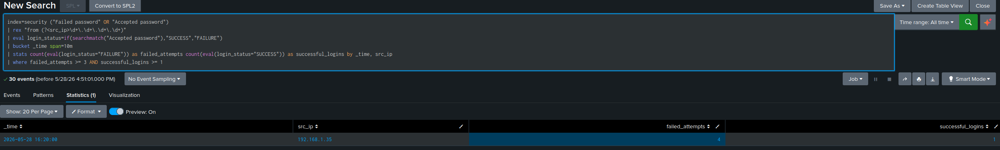

This detection was later converted into a Splunk alert.

---

## Splunk Alert Configuration

The time-window successful-login-after-failures detection was converted into a scheduled Splunk alert.

### Alert Details

| Setting | Value |
|---|---|
| Alert Name | SSH Successful Login After Multiple Failures |
| Alert Type | Scheduled |
| Schedule | Every 10 minutes |
| Time Range | Last 10 minutes |
| Trigger Condition | Number of results is greater than 0 |
| Severity | High |
| Trigger Action | Add to Triggered Alerts |

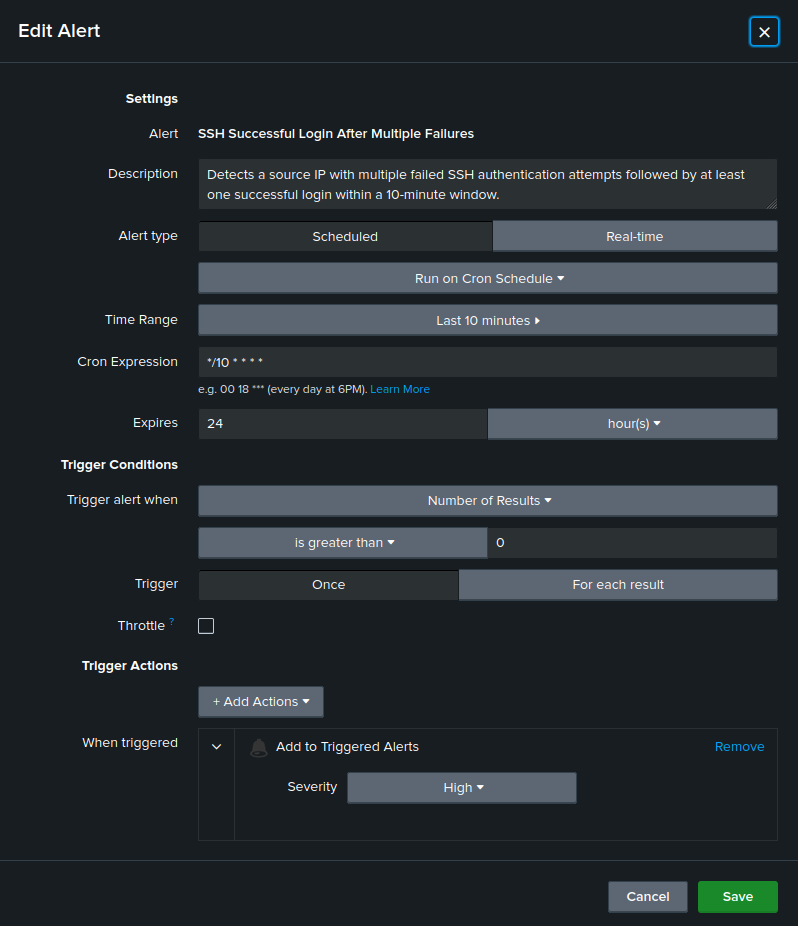

This alert simulates a realistic SOC detection rule that would notify analysts when suspicious authentication behavior occurs.

---

## Alert Validation

After creating the alert, I generated additional failed SSH login attempts followed by a successful login. The alert successfully triggered and appeared in Splunk's Triggered Alerts page.

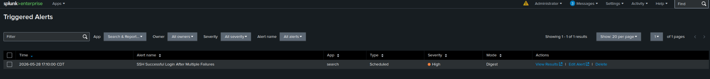

This validated the full detection workflow:

```text
Attack simulation
→ Linux authentication logs
→ Splunk ingestion
→ SPL detection logic
→ Scheduled alert
→ Triggered alert validation
```

---

## SOC Dashboard

A SOC-style authentication monitoring dashboard was created to visualize SSH authentication activity.

The dashboard included four panels:

| Panel | Purpose |
|---|---|
| Failed SSH Attempts Over Time | Shows spikes in failed authentication activity |
| Top Attacking Source IPs | Identifies source IPs responsible for failed logins |
| Username Targeting Activity | Shows which usernames were targeted |
| Successful Login After Multiple Failures | Displays suspicious correlated login behavior |

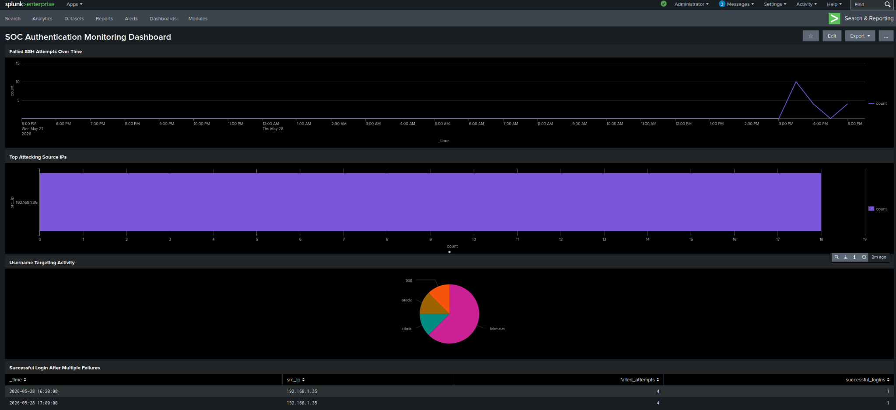

---

## Dashboard Panel: Failed SSH Attempts Over Time

```spl
index=security "Failed password"
| timechart count
```

This panel shows failed SSH login trends over time and helps identify spikes in authentication failures.

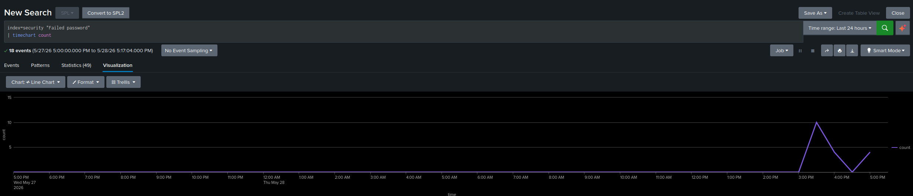

---

## Dashboard Panel: Top Attacking Source IPs

```spl
index=security "Failed password"
| rex "from (?<src_ip>\d+\.\d+\.\d+\.\d+)"
| stats count by src_ip
| sort - count
```

This panel identifies which source IPs generated the most failed SSH login attempts.

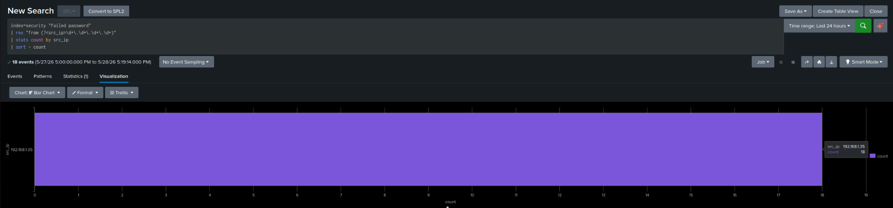

---

## Dashboard Panel: Username Targeting Activity

```spl
index=security "Failed password"
| rex "invalid user (?<username>\w+)"
| stats count by username
| sort - count
```

This panel shows which usernames were most frequently targeted during the attack simulations.

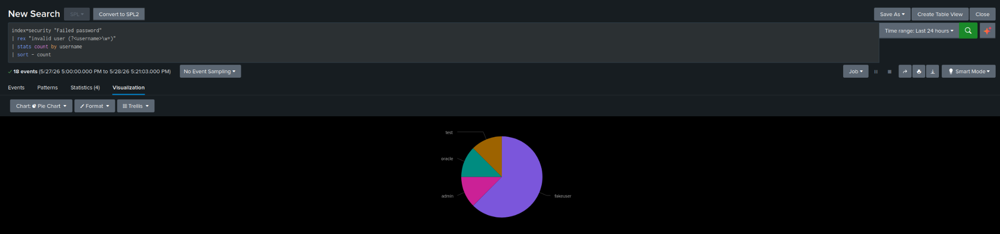

---

## Validation Methodology

Each detection was validated through controlled SSH authentication simulations.

### Validation Process

1. Confirmed Linux authentication logs were ingested into Splunk
2. Generated failed SSH login attempts from the Windows host
3. Verified raw failed login events appeared in Splunk
4. Extracted attacker source IP addresses from raw logs
5. Created brute force threshold detections
6. Added time windows to reduce false positives
7. Simulated username spraying with multiple attempted usernames
8. Generated failed logins followed by a successful login
9. Created a scheduled Splunk alert
10. Confirmed the alert appeared in Triggered Alerts
11. Built dashboard panels to monitor authentication activity

---

## Analyst Notes

Key observations from the lab:

- Failed SSH attempts were successfully captured from `/var/log/auth.log`
- Source IP extraction allowed attacker activity to be grouped and summarized
- Threshold-based detection helped identify repeated failed login behavior
- Time-window logic made detections more realistic and reduced false positives
- Username targeting activity showed account enumeration behavior
- Successful login after multiple failures created a higher-confidence detection
- The Splunk alert successfully triggered after the suspicious login sequence was recreated
- Dashboard visualizations provided a SOC-style view of authentication activity

---

## Skills Demonstrated

This project demonstrates practical experience with:

- Splunk Search Processing Language
- Linux authentication log analysis
- SSH attack simulation
- Brute force detection logic
- Username spray detection
- Regex field extraction
- Threshold-based detections
- Time-window correlation
- Alert creation and validation
- SOC dashboard development
- Detection engineering methodology
- Security documentation

---

## Lessons Learned

This lab reinforced several important SOC analyst concepts:

- Detection engineering requires more than searching logs; detections must be validated.
- Time windows are critical for reducing false positives.
- Raw logs often need field extraction before they become useful for analysis.
- Authentication attacks can be analyzed through source IPs, usernames, timing, and success/failure patterns.
- A successful login after repeated failures is more suspicious than failed logins alone.
- Dashboards are useful for quickly identifying trends, but alerts provide actionable detection logic.
- Clear documentation is essential for explaining technical work in a portfolio.

---

## Conclusion

This project built a complete SOC-style authentication monitoring workflow in Splunk. It started with Linux authentication log ingestion, progressed through failed SSH login analysis, source IP extraction, brute force detection, username spray detection, alert creation, validation testing, and dashboard development.

The final result is a focused detection engineering lab that demonstrates practical SOC analyst skills using realistic SSH authentication telemetry.
